# CyberGRUB-2077


Tema de GRUB inspirado en Cyberpunk 2077.

<details>
  <summary><h2>LOGOS</h2></summary>
	
|||||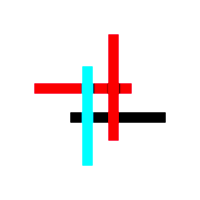|||
|:---:|:---:|:---:|:---:|:---:|:---:|:---:|
| 4m | alma | alpine | antergos | antix | arch | bedrock | 
|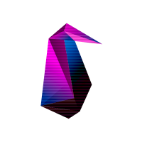||||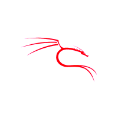|||
|clear | debian | deepin | guix | kali | kaos | manjaro |
||||||||
| elementary | endeavouros | endless | fedora | feren | garuda | gentoo |
|||||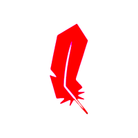||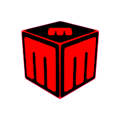|
| kubuntu | lfs | linux | linuxmint | lite | lubuntu | mabox |
||||||||
| macos | mageia | opensuse | parrot | peppermint | pop | gnu |
||||||||
| mate | mx-linux | neon | netrunner | nixos | openmandriva | slackware |
||||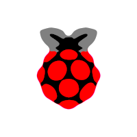||||
| puppy | q4os |  qubes| raspios | reborn | redhat | rosa |
||||||||
| knoppix | septor | xubuntu | zorin | freebsd | solus | cachyos |
|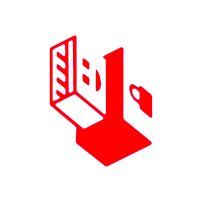|||||||
| tails | tinycore | ubuntu | ubuntuDDE | unity | void | windows |
|||||||
| apple | bluestar | arco | centos | cinnamon | bodhi |
||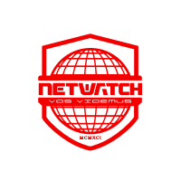|||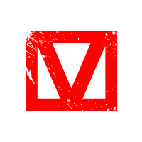|||
| delamain | netwatch | maelstrom | arasaka | militech | kang-tao | trauma-team |
|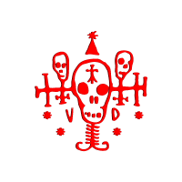||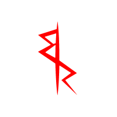||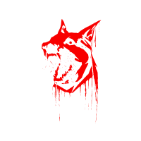|||
| voodoo-boys | biotechnica | edgerunners | samurai | barghest | tyger-claws | wraiths |
||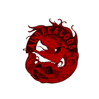|||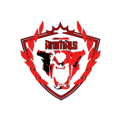| | |
| 6th-street | aldecaldos | valentinos | the-mox | animals | | |

</details>

<a href="README.md">
    
</a>

<a href="README-es.md">
	
</a>

<a href="README-pt.md">
    
</a>

<a href="README-ru.md">
    
</a>

## Instalación [LOCAL]

### 1. Clona el repositorio

```shell
git clone https://github.com/adnksharp/CyberGRUB-2077
```

### 2. Entra en la carpeta donde descargaste el repositorio

```shell
cd CyberGRUB-2077
```

### 3. Ejecuta el script de instalación como administrador

```shell
sudo $SHELL ./install.sh
```

> [!IMPORTANT]
> En el caso de fish, es preferible utilizar `sudo fish ./install.fish`

<details>
	<summary><h4>3.1 Opciones extra</h4></summary>

Optionamente, puedes especificar un logo diferente usando las opciones `-L` o `--logo`:

```shell
sudo $SHELL ./install.sh -L <logo>
```


Para ver la lista de logos disponibles  usa la opción `-l` o `--list`:

```shell
sudo $SHELL ./install.sh -l
```

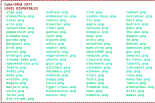

Para ver el mensaje de ayuda usa la opción `-h` o `--help`:

```shell
sudo $SHELL ./install.sh -h
```


</details>

### 4. Prueba tu nuevo tema


## Instalación [VENTOY]

### 1. Accede al directorio de Ventoy

### 2. Clona el repositorio

```shell
git clone https://github.com/adnksharp/CyberGRUB-2077
```

### 3. Accede a la carpeta donde descargaste el repositorio

```shell
cd CyberGRUB-2077
```

### 4. Ejecuta el script de instalación con `-p` o `--ventoy`

```shell
$SHELL ./install.sh -p
```

> [!IMPORTANT]
> En el caso de fish, es mejor usar `fish install.fish -p`
